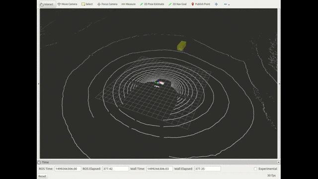

# Didi-Udacity Self Driving Car Challenge 2017

One of the most important aspects of operating an autonomous vehicle is understanding the surrounding environment in order to make safe decisions. Udacity and Didi Chuxing are partnering together to provide incentive for students to come up with the best way to detect obstacles using camera and LIDAR data. This challenge will allow for pedestrian, vehicle, and general obstacle detection that is useful to both human drivers and self-driving car systems.

Competitors will need to process LIDAR and Camera frames to output a set of obstacles, removing noise and environmental returns. Participants will be able to build on the large body of work that has been put into the Kitti datasets and challenges, using existing techniques and their own novel approaches to improve the current state-of-the-art.

- Reference: Self-Driving Car competition, https://challenge.udacity.com/

## Contributors
Jaeil Park, Truong Hong Minh, Oran Kwon and Hanbin Lee

## Methodology
Detected car and pedestrian in real time (> 10HZ) using <b>LIDAR data only</b>.

### Pedestrian detection
* Cluster 3D Points using region growing clustering of depth map grid cells
* Filter out clusters with width and depth
* Select most probable cluster
* Track selected cluster

### Car detection
* Cluster 3D Points using region growing clustering of depth map grid cells
* Filter out clusters with width and depth
* Project clustered points on 360 degree panoramic view
* Predict boxes with pre-trained deep neural network
* Cluster boxes and select most probable box
* Track selected box

## How to setup

### How to setup environment
* Install python-2.7 or Anaconda-2 (recommended)
* Install pandas version 0.19.2
* Install ROS

        $ sudo apt-get install ros-indigo-desktop-full

* Setup ROS environment - add following to ~/.bashrc

        source /opt/ros/indigo/setup.bash
		source ~/catkin_ws/devel/setup.bash
		export ROS_MASTER_URI=http://localhost:11311 export ROS_HOSTNAME=localhost

* Install Eigen
* Install PCL ROS
* Install ROS BAG
* Install scikit-learn
* Install CUDA and CuDNN
* Install tensorflow-gpu

        $ pip install tensorflow-gpu

* Install keras

        $ pip install keras

### How to setup development environment with Qt (optional)
* Go to catkin workspace

        $ cd ~/catkin_ws/src

* Download kor_didi_pkg source
* Move the original file of catkin_ws/src/CMakeLists.txt (should be /opt/ros/indigo/share/catkin/cmake/toplevel.cmake) to catkin_ws/src/, and change the file name to CMakeLists.txt
* Setup Qt Creator permission - add following to ~/.bashrc

        sudo -s chmod o+w /home/parkjaeil0108/.config/QtProject/qtcreator/*.xml
        sudo chown -R $USER:$USER /home/parkjaeil0108/.config/QtProject/
        sudo -s chmod o+w /home/parkjaeil0108/catkin_ws/src/kor_didi_pkg/*.*

* Open Qt Creator

        $ qtcreator

* Open catkin_ws/src/CMakeLists.txt on Qt Creator, set build directory to ~/catkin_ws/build

## How to run

### How to run object_tracker
* Go to catkin workspace

        $ cd ~/catkin_ws/src

* Download object_tracker source

        $ git clone 'this git url'

* Go to catkin workspacee

        $ cd ~/catkin_ws
* Build

        $ catkin_make

* Run object_tracker in ros_script

    - Pedestrian detection
    
            $ object_tracker --ped

    - Car detection
    
            $ object_tracker --car

* Run rviz to visualize (optional)

        $ rviz

    - Fixed frame: velodyne
    - Topics: PointCloud2(/velodyne_points), MarkerArray(/tracker/boxes/markers/predict)

* Run bag_player in ros_script with bag file path

        $ bag_player --file_path [full path of .bag file]

    - ex)
    
            $ bag_player --file_path /home/jaeil/challenge/Didi-Training-Release-1/approach_1.bag

* Generate tracklet with bag_player in ros_script with bag file path and tracklet save directory to generate tracklet

        $ bag_player --file_path [full path of .bag file] --tracklet [directory to save tracklet file]

    - ex)
    
            $ bag_player --file_path /home/jaeil/challenge/Didi-Training-Release-1/approach_1.bag --tracklet /home/jaeil/challenge/tracklet
